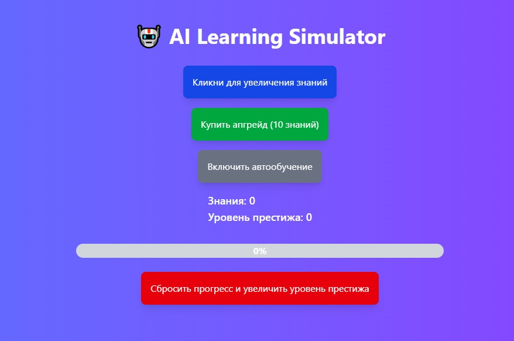

# AI Learning Simulator


AI Learning Simulator — это симулятор процесса обучения ИИ, где ты можешь кликать, чтобы увеличить количество "знаний", покупать апгрейды, а также включить автообучение, чтобы ИИ учился сам. Система престижа добавляет дополнительную мотивацию для сброса прогресса и получения бонусов.

Проект создан с использованием **React**, **TypeScript**, **Vite**, **Tailwind CSS** и **Zustand**.

## Демо

🔗 [Посмотреть проект на Vercel](https://ai-clicker.vercel.app/)

## Функции

- **Клик для увеличения знаний**: Каждое нажатие на кнопку увеличивает количество знаний.
- **Апгрейды**: Покупка апгрейдов увеличивает количество знаний за клик.
- **Автообучение**: Включение автообучения позволяет ИИ получать знания автоматически.
- **Престиж**: Система престижа позволяет сбрасывать прогресс для получения бонусов.
- **Сохранение прогресса**: Прогресс сохраняется в LocalStorage, чтобы можно было продолжить игру с того места, где ты остановился.

## Установка и запуск

### Клонирование репозитория

Склонируй проект на свой локальный компьютер:

```bash
git clone https://github.com/vinkol/ai-clicker.git
